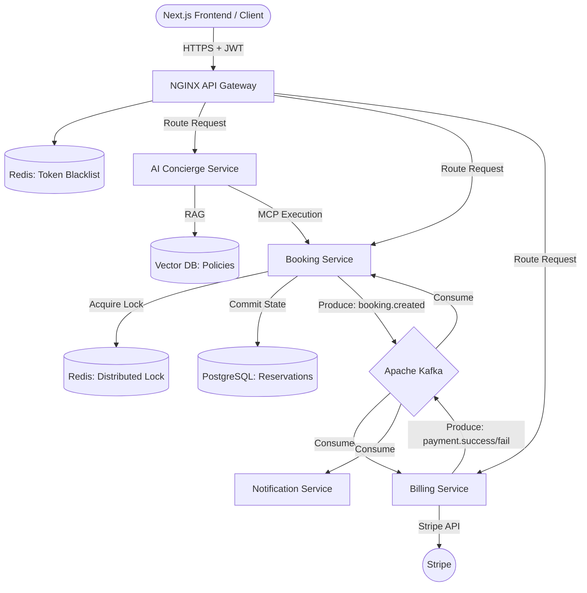

# 🏢 NexusSpace: Intelligent Enterprise Workspace Manager


An event-driven, multi-tenant facility management platform. NexusSpace acts as an "Operating System" for corporate campuses, allowing employees to manage physical resources, process department chargebacks, and resolve issues via an AI-driven, natural language concierge.

## 🚀 The SDE-2 Engineering Challenges Solved
This project moves beyond standard CRUD operations to tackle complex distributed systems challenges:
- **Zero-Conflict Scheduling:** Implemented distributed locking via **Redis (Redlock)** to prevent race conditions during high-concurrency booking attempts (e.g., millisecond-level double-booking prevention).
- **Distributed Data Consistency:** Designed a **Saga Pattern** using **Apache Kafka** to orchestrate transactions across disparate databases. Guarantees rollback of PostgreSQL reservations if external payment gateways (Stripe) fail.
- **Secure AI Orchestration:** Integrated an LLM via **Model Context Protocol (MCP)** and **RAG**, passing stateless JWT contexts to ensure the AI agent respects strict internal RBAC (Role-Based Access Control) when mutating system states.

---

## 🏗️ System Architecture



---

## 🛠️ Tech Stack & Microservices

| Service | Technology | Responsibility |
| :--- | :--- | :--- |
| **API Gateway** | Spring Cloud Gateway | Entry point, strict JWT validation, stateless session routing. |
| **Booking Engine** | Spring Boot, Data JPA | Core state machine. Handles pessimistic DB locking & Saga orchestration. |
| **Billing Service** | Spring Boot, Stripe API | Financial edge service. Idempotent payment processing. |
| **AI Concierge** | Spring AI, LangChain4j | RAG-enabled LLM. Executes actions via strict MCP Tool interfaces. |
| **Event Broker** | Apache Kafka | Decouples services, ensures fault-tolerant asynchronous communication. |

---

## 🔄 The Golden Flow: Saga Pattern in Action
When a user asks the AI to book a paid premium resource, the system executes the following distributed transaction:
1. **AI Service** translates natural language to an MCP tool execution (`create_booking`).
2. **Booking Service** acquires a Redis lock, writes `STATUS: PENDING` to PostgreSQL, and publishes a `booking.created` event to Kafka.
3. **Billing Service** consumes the event and attempts the Stripe charge using an Idempotency Key.
4. **If Payment Succeeds:** Billing publishes `payment.success`. Booking consumes and updates DB to `CONFIRMED`.
5. **If Payment Fails:** Billing publishes `payment.failed`. Booking executes a **Compensating Transaction**, updating DB to `CANCELLED` and releasing the lock.

---

## 💻 Local Development Setup

To test the resilience of the architecture locally, the entire infrastructure is containerized.

### Prerequisites
- Docker & Docker Compose
- Java 17+
- Stripe API Key (for Billing Service)

### Spin up the Infrastructure
Bring up Kafka, Zookeeper, PostgreSQL, and Redis in the background:
```bash
docker-compose -f infra-compose.yml up -d
```

### Run the Microservices
*Note: Ensure the infrastructure containers are healthy before starting the Spring Boot applications.*
```bash
# Terminal 1: Start Discovery/Gateway
./mvnw spring-boot:run -pl api-gateway

# Terminal 2: Start Core Services
./mvnw spring-boot:run -pl booking-service
./mvnw spring-boot:run -pl billing-service
```

---

## 🔒 Security & Auth
All endpoints require a digitally signed `HttpOnly` JWT. The system enforces 4 strict roles:
- `SUPER_ADMIN`
- `FACILITY_MANAGER`
- `EMPLOYEE`
- `GUEST_TENANT`

*Attempting to execute an MCP tool without the correct JWT authority will result in a hard 403 Forbidden at the Gateway level.*
